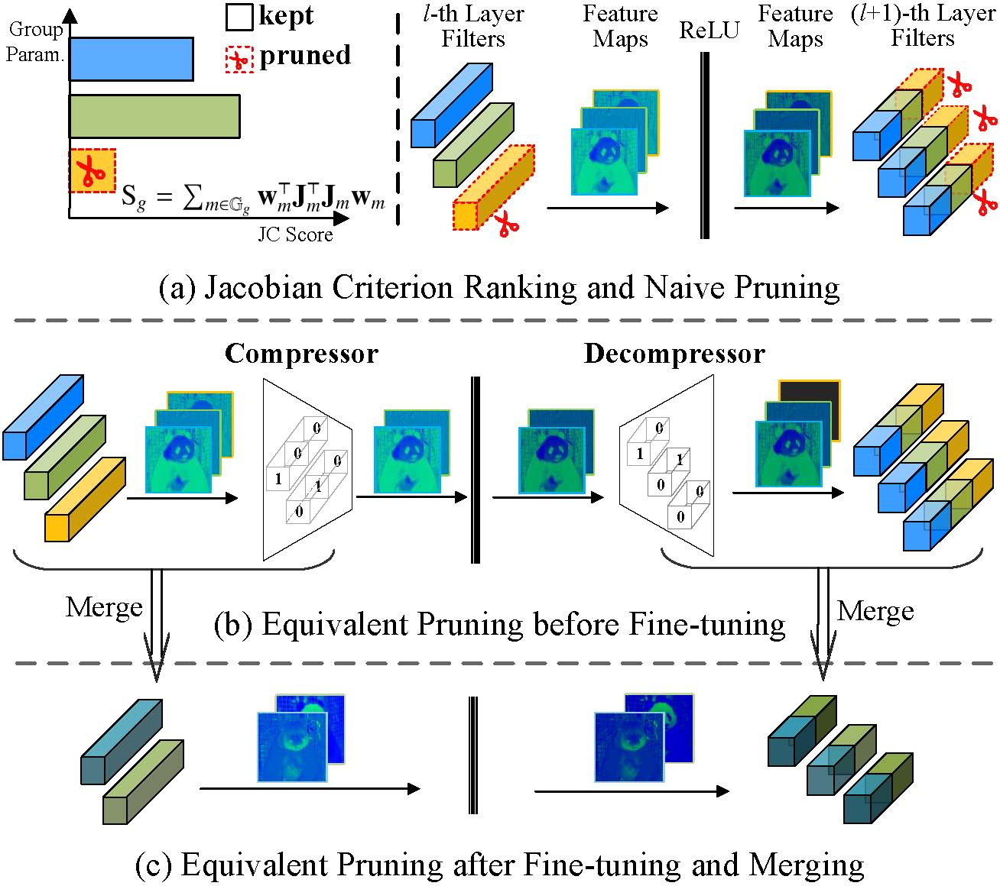
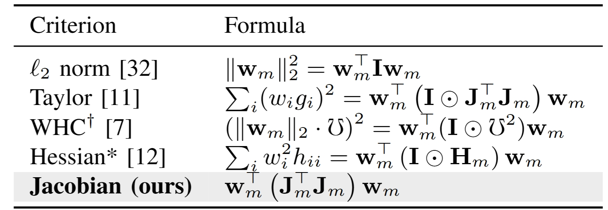
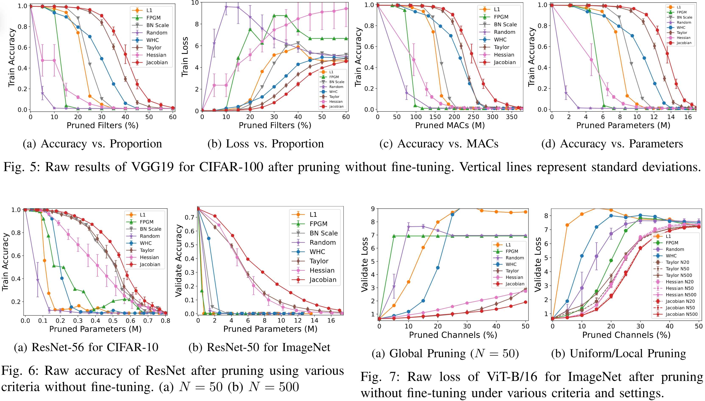
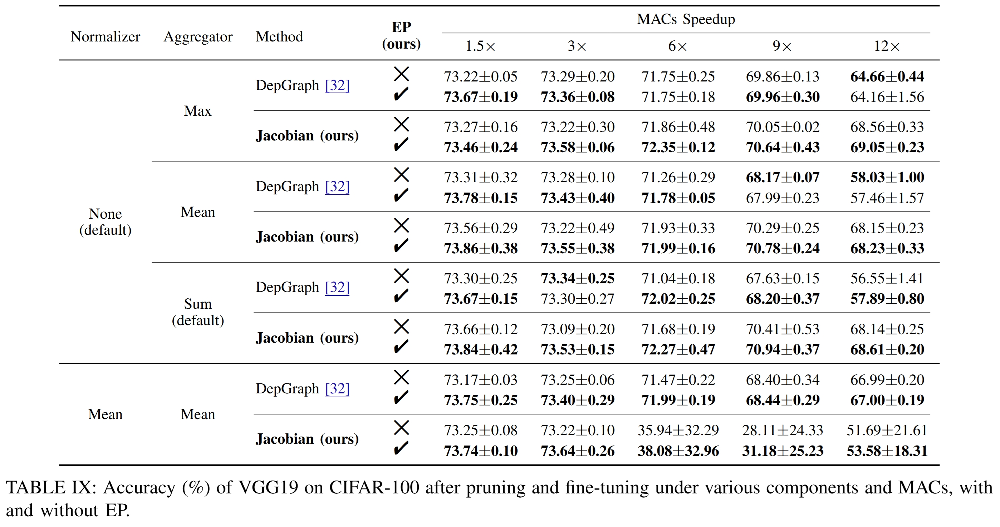

# [Optimal Brain Connection: Towards Efficient Structural Pruning](https://arxiv.org/abs/2508.05521)

<div style="text-align: center;">
  
  <p style="margin-top: 5px; font-style: italic;">Fig.1 Our OBC framework.</p>
</div>


This repository contains the code for our paper, `Optimal Brain Connection: Towards Efficient Structural Pruning`. ([Download the paper here](https://arxiv.org/abs/2508.05521)).

This project is built upon [Depgraph](https://github.com/VainF/Torch-Pruning). We sincerely thank the authors for their open-source work.

## Contributions

- **1. Jacobian Criterion (JC)**: We propose an efficient first-order criterion that takes parameter interaction into consideration for accurate importance evaluation (see `Fig.1 a`).
$$
\mathcal{S}\left(\{\mathbf{w}_m|m\in\mathbb{G}_g\}\right)\triangleq 
 \sum_{m\in \mathbb{G}_g}\mathcal{S}^{\rm (1)}(\mathbf{w}_m)\triangleq\sum_{m\in \mathbb{G}_g}\mathbf{w}_m^{\top}\left(\mathbf{J}_m^{\top}\mathbf{J}_m\right)\mathbf{w}_m
$$

<p style="margin-top: 8px; font-style: italic;">Here our JC  takes parameter interaction into consideration via the off-diagonal elemenets of the dense `J_m^T J'.  </p>
<div style="text-align: center;">  

</div>


<div style="text-align: center;">
  
  <p style="margin-top: 5px; font-style: italic;">JTJ of 16 filters </p>
</div>

  <p style="margin-top: 8px; font-style: italic;">Our JC outperforms several popular criteria: </p>
<div style="text-align: center;">
  
</div>


****

- **2. Equivalent Pruning (EP)**: We propose an AutoEncoder-based pruning mechanism that retains the contributions of all original parameters or connections during fine-tuning to enhance performance (See `Fig.1 b` and `Fig.1 c`).

<p style="margin-top: 5px; font-style: italic;">EP works very well for both JC and Depgraph:</p>
<div style="text-align: center;">
  
</div>

## Contact and Citation
Feel free to email me at `shaowu-chen@foxmail.com`.

If the code or paper helps your work, please cite our paper:
```
@article{chen2025optimal,
  title={Optimal Brain Connection: Towards Efficient Structural Pruning},
  author={Chen, Shaowu and Ma, Wei and Huang, Binhua and Wang, Qingyuan and Wang, Guoxin and Sun, Weize and Huang, Lei and John, Deepu},
  journal={arXiv preprint arXiv:2508.05521},
  year={2025}
}
```

## Code File Explanation
### To see our Jacobian Criterion
- `Selfmake_Importance.py`: This file contains our `Jacobian Criterion` and WHC. You can use it as an `importance` metric like those provided in the official Torch-Pruning library.
    
    Here is a demo of how to use our Jacobian Criterion:
    ```python
    '''demo'''
    import torch
    from Selfmake_Importance import GroupJacobianImportance_accumulate
    import torch_pruning as tp

    N_batchs, pruning_ratio, iterative_steps = 50, 0.9, 18 # each step prunes 0.9/18=5% of filters
    imp = GroupJacobianImportance_accumulate(group_reduction='sum', normalizer=None) # sum, no normalizer
    model, example_inputs, ignored_layers, train_loader, ... = ... # See the Depgraph framework

    pruner = tp.pruner.MetaPruner(
        model,
        example_inputs,
        iterative_steps=iterative_steps,
        importance=imp,
        pruning_ratio=pruning_ratio, 
        ignored_layers=ignored_layers,
        global_pruning=True)

    # This part is the main usage code, which accumulates the dense Jacobian Matrix for scoring
    for i in range(iterative_steps):
        model.eval()      

        imp.zero_score() # clear the afore scores
        imp.zero_grad() # clear the accumulated gradients

        for k, (imgs, lbls) in enumerate(train_loader):
            if k>=N_batchs: break
            imgs, lbls = imgs.cuda(), lbls.cuda()
            output = model(imgs) 
            loss = torch.nn.functional.cross_entropy(output, lbls)
            model.zero_grad() # clear gradients
            loss.backward()
            imp.accumulate_grad(model) # accumulate Jacobian  
            if (k+1)%50==0 or k==N_batchs-1:
                imp.accumulate_score(model)
                torch.cuda.empty_cache()  # in case of CUDA OUT OF MEMORY 

        # Now we have the Jacobian Matrix and thus the score, so we can prune the least important groups
        pruner.step()
    ```

### To compare criteria without fine-tuning
- `benchmark_cifar.py`: This file compares criteria on VGG or ResNet using CIFAR-10/100.

    How to run:
    - first install Depgraph and download pretrained weights
    ```bash
    pip install torch-pruning --upgrade
    mkdir -p ./results/base_model/
    wget -P ./results/base_model/  https://github.com/ShaowuChen/Optimal_Brain_Connection/releases/download/v0/cifar100_vgg19.pth
    wget -P ./results/base_model/  https://github.com/ShaowuChen/Optimal_Brain_Connection/releases/download/v0/cifar10_resnet56.pth
    ``` 
    - then run
    ```bash
    CUDA_VISIBLE_DEVICES=0 python benchmark_cifar.py --model vgg19 --pth_path ./results/base_model/cifar100_vgg19.pth --data_root /your/data/root --repeats 5 --N_batchs 50 --global_pruning  --pruning_ratio 0.9 --iterative_steps 18 
    CUDA_VISIBLE_DEVICES=1 python benchmark_cifar.py --model resnet56 --pth_path ./results/base_model/cifar10_resnet56.pth --data_root /your/data/root --repeats 5 --N_batchs 50 --global_pruning  --pruning_ratio 0.9 --iterative_steps 18 
    ```
- `benchmark_ViT.py`: This script compares criteria on ViT-B/16 using ImageNet.

    How to run:
    ```bash
    CUDA_VISIBLE_DEVICES=0 python benchmark_ViT.py --data_path /your/data/root --repeats 10 --N_batchs 50 --normalizer None 
    CUDA_VISIBLE_DEVICES=1 python benchmark_ViT.py --data_path /your/data/root --repeats 10 --N_batchs 50 --normalizer None --global_pruning
    CUDA_VISIBLE_DEVICES=2 python benchmark_ViT.py --data_path /your/data/root --repeats 10 --N_batchs 50 --normalizer None --global_pruning --bottleneck --save_prefix Bottleneck
    ```

### To see our Equivalent Pruning or implement the main experiment
- `main_cifar.py`: Implements pruning, our `Equivalent Pruning`, and one-shot fine-tuning for VGG-19 and ResNet-56 on the CIFAR-10/100 datasets.
- `main_imagenet_EP_resnet.py`: Implements pruning, our `Equivalent Pruning`, and one-shot fine-tuning for ResNet-50 on ImageNet.
- `main_imagenet_EP_mobilenet.py`: Implements pruning, our `Equivalent Pruning`, and one-shot fine-tuning for MobileNetV2 on ImageNet.
- `main_imagenet_EP_VIT.py`: Implements pruning, our `Equivalent Pruning`, and fine-tuning for ViT on ImageNet.

    Note:

    - (The last three files are almost the same but with some minor differences. I was just too lazy to merge them.)


How to run: Find the scripts in
- `run_cifar.sh`: Scripts to reimplement the main experiments on CIFAR.
- `run_Imagenet.sh`: Scripts to reimplement the main experiments on ImageNet.

    Note:

    - For Cifar, add `--equivalent` to use EP. After EP finetuning, it will finally train a naive version for comparison.
    - For ImageNet, add `--equal_pruning` to use EP. To train a navie version as well, please add `--train_naive_pruning`.